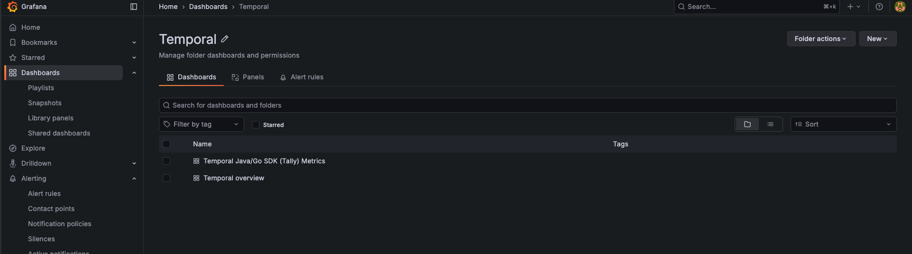
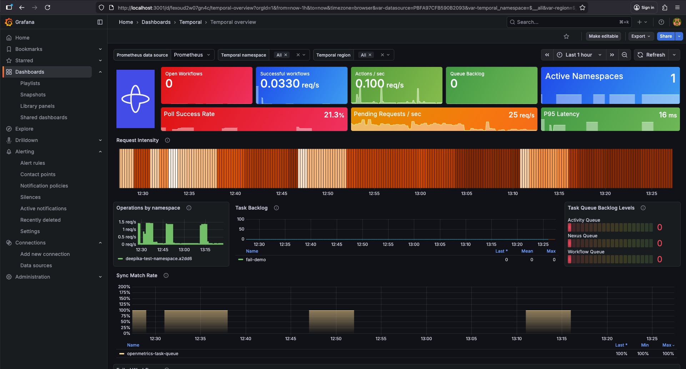
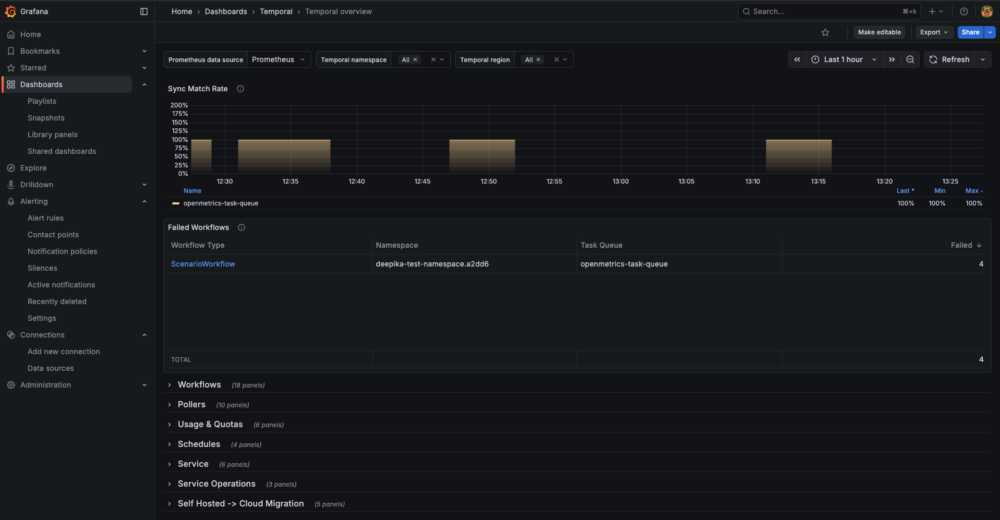
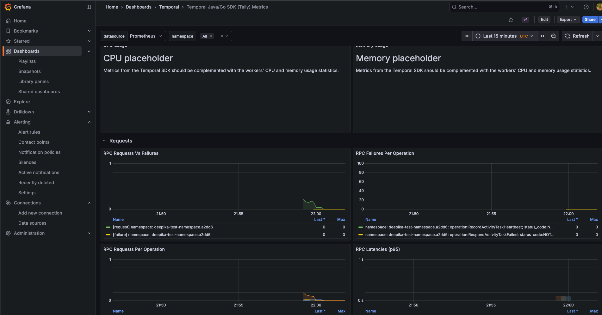
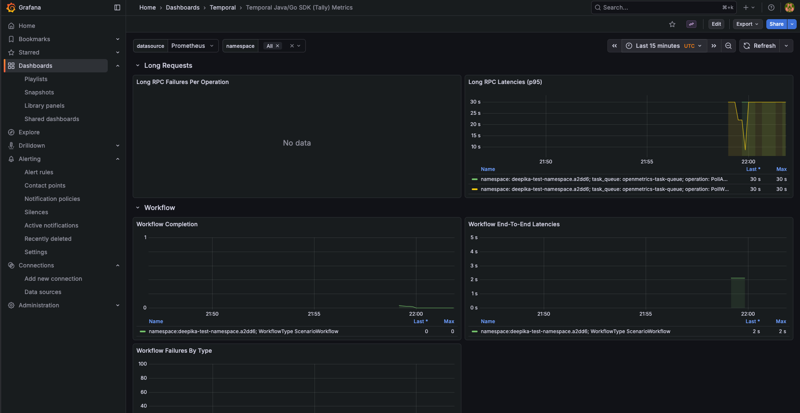
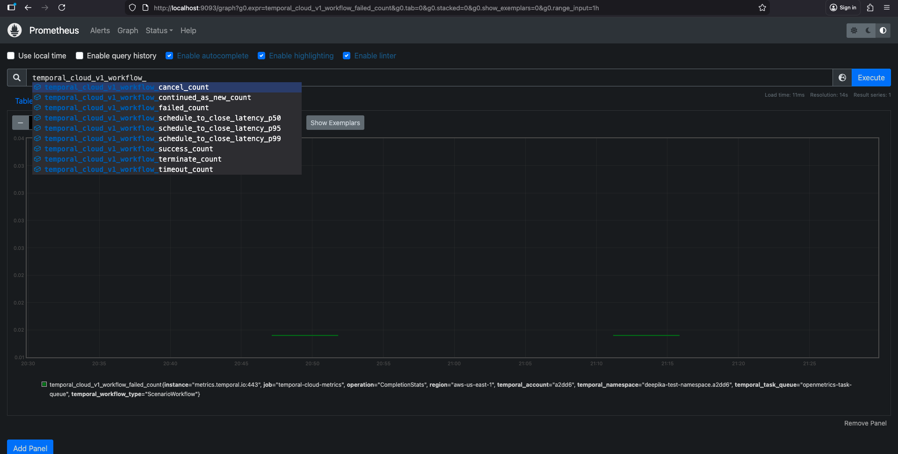
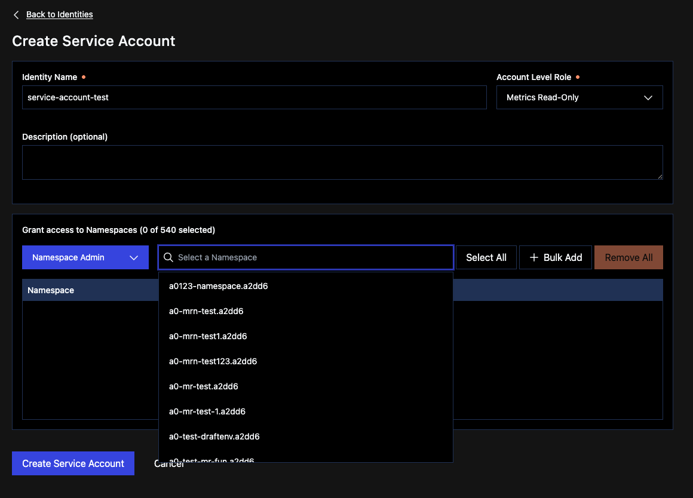

# Temporal Cloud OpenMetrics → Prometheus → Grafana (Step-by-step)

This demo shows how to **scrape Temporal Cloud OpenMetrics(https://docs.temporal.io/cloud/metrics/openmetrics/)** 
with **Prometheus** and **visualize them in Grafana**.

It uses the Grafana Temporal mixin dashboard template:
https://github.com/grafana/jsonnet-libs/blob/master/temporal-mixin/dashboards/temporal-overview.json

Once imported/provisioned, the dashboard lets you view the key Temporal metrics in a ready-made layout.
it may take a second to load, refresh if it takes longer than that. 



Grafana dashboard view :-

**temporal cloud openmetrics** 




**worker metrics**



Prometheus :-

**cloud metrics**

**worker metrics**


---

## 1) Create Service Account + API Key (Temporal Cloud)

1. Create a service account with **Metrics Read-Only** role
   OpenMetrics auth reference:
   https://docs.temporal.io/production-deployment/cloud/metrics/openmetrics/api-reference#authentication

    In Temporal Cloud UI:
    - **Settings → Service Accounts**
      - Create a service account with **Metrics Read-Only** role
      - Generate an **API key** ( copy this, it will be needed later)
    ---
2. Add your namespace and assign namespace permission




** This approach is only for testing, for production either have 2 service account 1 for running workflows and 1 for metrics reading
to have more control on API keys ** 


## 2) Update Prometheus scrape config

prometheus/config.yml
Update it to use your namespace
```
    params:
      namespaces: [ '<namespace>.<account-id>' ]
```


## 3) Start Prometheus + Grafana

docker compose up -d
docker compose ps

## 4) Ran the sample and view the cloud metrics

Terminal 1 
**export below env variables in the respective terminal for running WorkerMain**

export TEMPORAL_API_KEY=<api_created_above>
export TEMPORAL_NAMESPACE="<namespace>.<account-id>"
export TEMPORAL_ADDRESS="<region>.<cloud-provider>.api.temporal.io:7233" (regional endpoint for API auth) 

- `./gradlew -q execute -PmainClass=io.temporal.samples.temporalmetricsdemo.WorkerMain`

Terminal 2 

**export env variables again for running Starter**

- `METRICS_PORT=9465 ./gradlew -q execute -PmainClass=io.temporal.samples.temporalmetricsdemo.Starter`

starter logs
```
➜  samples-java git:(deepika/openmetrics-demo) ✗ METRICS_PORT=9465 ./gradlew -q execute -PmainClass=io.temporal.samples.temporalmetricsdemo.Starter
Worker metrics exposed at http://0.0.0.0:9465/metrics
13:58:44.102 { } [main] INFO  i.t.s.WorkflowServiceStubsImpl - Created WorkflowServiceStubs for channel: ManagedChannelOrphanWrapper{delegate=ManagedChannelImpl{logId=1, target=deepika-test-namespace.a2dd6.tmprl.cloud:7233}} 

=== Starting scenario: success workflowId=scenario-success-6120c15f-b2f0-40cb-b3a6-f39bf0af6698 ===
Scenario=success Result=Hello Temporal

=== Starting scenario: fail workflowId=scenario-fail-0ff499af-1c3c-4a78-b75d-7d24c66ef46d ===
Scenario=fail ended: WorkflowFailedException - Workflow execution {workflowId='scenario-fail-0ff499af-1c3c-4a78-b75d-7d24c66ef46d', runId='', workflowType='ScenarioWorkflow'} failed. Metadata: {closeEventType='EVENT_TYPE_WORKFLOW_EXECUTION_FAILED', retryState='RETRY_STATE_RETRY_POLICY_NOT_SET', workflowTaskCompletedEventId=10'}

=== Starting scenario: timeout workflowId=scenario-timeout-e63954fb-c39b-4fb4-9dc9-ee2fa2835b52 ===
Scenario=timeout ended: WorkflowFailedException - Workflow execution {workflowId='scenario-timeout-e63954fb-c39b-4fb4-9dc9-ee2fa2835b52', runId='', workflowType='ScenarioWorkflow'} timed out. Metadata: {closeEventType='EVENT_TYPE_WORKFLOW_EXECUTION_TIMED_OUT', retryState='RETRY_STATE_RETRY_POLICY_NOT_SET'}

=== Starting scenario: continue workflowId=scenario-continue-26e780ab-1f0a-4222-9b2b-5c09c62cb824 ===
Scenario=continue Result=Hello Temporal

=== Starting scenario: cancel workflowId=scenario-cancel-08c9d1f6-6bfb-4ee9-9a5d-23b35fe1af7c ===
Scenario=cancel ended: WorkflowFailedException - Workflow execution {workflowId='scenario-cancel-08c9d1f6-6bfb-4ee9-9a5d-23b35fe1af7c', runId=''} was cancelled. Metadata: {closeEventType='EVENT_TYPE_WORKFLOW_EXECUTION_CANCELED', retryState='RETRY_STATE_NON_RETRYABLE_FAILURE'}
<===========--> 87% EXECUTING [18m 6s]

```
there will be some failures in the worker logs as we are intentionally failing workflows for the data generation purpose.
give few seconds to see the data in both the dashboard and try to run couple of workflows so the rate
queries show properly.

## 5) View Grafana dashboard

http://localhost:3001/

- Username: admin
- Password: admin

You should see the Temporal Cloud OpenMetrics dashboard.

## 6) Verify metrics in Prometheus

Prometheus: http://localhost:9093/

Go to:
Status → Targets (make sure the scrape target is UP)
Graph tab (search for Temporal metrics and run a query)

